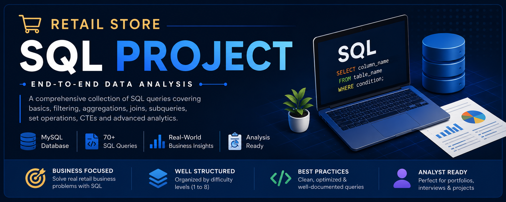
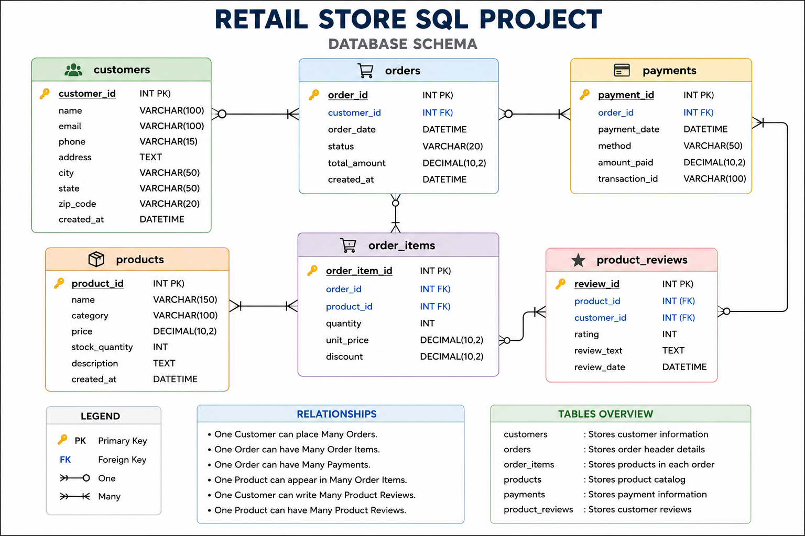
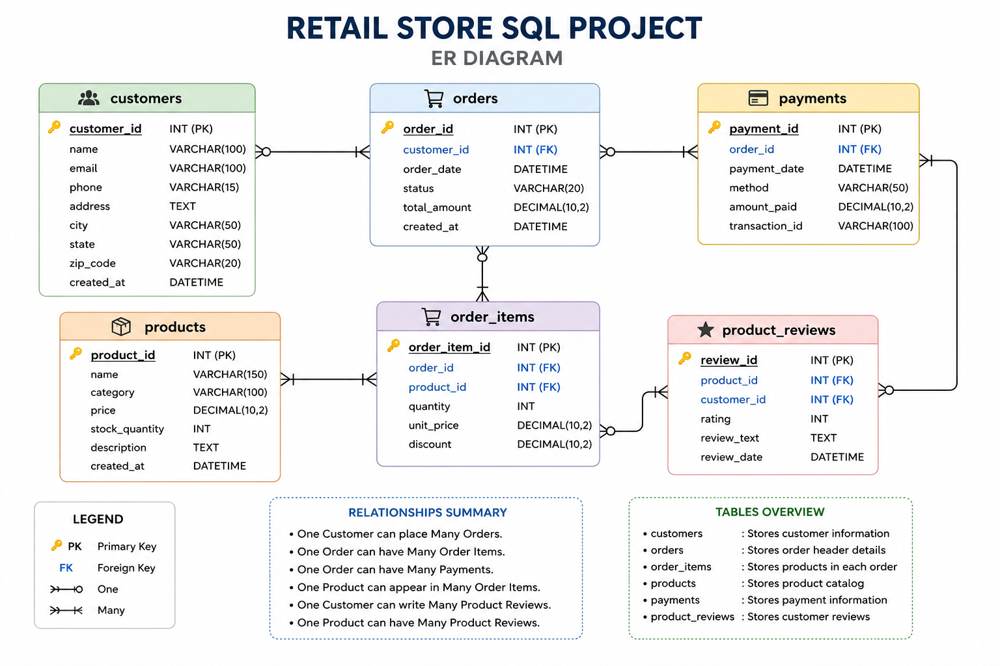
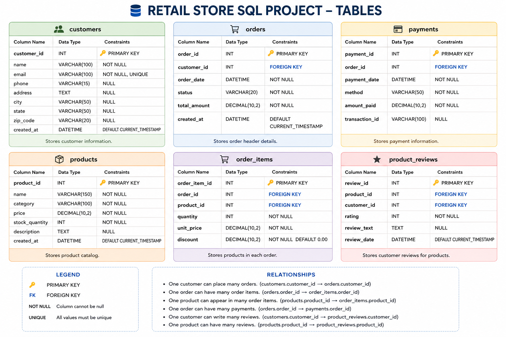

# 🛒 Retail Store SQL Project

<p align="center">


</p>

<p align="center">

</p>

---

# 📌 Project Overview

This project demonstrates an **End-to-End SQL Data Analysis** workflow using a **Retail Store Database** built in **MySQL**.

The project covers everything from database design to advanced SQL querying and real-world business problem solving.

It is designed to showcase SQL skills required for **Data Analyst**, **Business Analyst**, and **SQL Developer** roles.

---

# 🎯 Project Objectives

- Design a relational retail database
- Perform business analysis using SQL
- Solve real-world retail business problems
- Practice SQL from beginner to advanced
- Build a professional portfolio project

---

# 🛠 Technologies Used

- MySQL 8.0
- MySQL Workbench
- SQL
- Git
- GitHub

---

# 🗄 Database Schema

<p align="center">

</p>

---

# 📊 Entity Relationship Diagram (ERD)

<p align="center">

</p>

---

# 📂 Project Structure

```text
Retail-Store-SQL-Project
│
├── database/
│   ├── create_database.sql
│   ├── create_tables.sql
│   ├── insert_data.sql
│   └── retail_store_database.sql
│
├── queries/
│   ├── Level-1_Basics.sql
│   ├── Level-2_Filtering.sql
│   ├── Level-3_Aggregations.sql
│   ├── Level-4_Joins.sql
│   ├── Level-5_Subqueries.sql
│   └── Level-6_Set_Operations.sql
│
├── images/
│   ├── project_banner.png
│   ├── database_schema.png
│   ├── er_diagram.png
│   └── tables.png
│
├── report/
│   └── SQL_Project_Report.pdf
│
├── README.md
├── LICENSE
└── .gitignore
```

---

# 📋 Database Tables

| Table | Description |
|--------|-------------|
| Customers | Stores customer information |
| Products | Stores product catalog |
| Orders | Stores customer orders |
| Order_Items | Stores ordered products |
| Payments | Stores payment details |
| Product_Reviews | Stores customer reviews |

---

# 📚 SQL Concepts Covered

## ✅ Level 1 — Basics

- SELECT
- WHERE
- ORDER BY
- DISTINCT
- BETWEEN
- LIKE
- IN

---

## ✅ Level 2 — Filtering & Formatting

- Aliases
- CONCAT()
- Calculated Columns
- LEFT JOIN
- IS NULL

---

## ✅ Level 3 — Aggregations

- COUNT()
- SUM()
- AVG()
- ROUND()
- GROUP BY
- ORDER BY
- DISTINCT

---

## ✅ Level 4 — JOINS

- INNER JOIN
- LEFT JOIN
- RIGHT JOIN
- Multi-table JOIN

---

## ✅ Level 5 — Subqueries

- Single Row Subqueries
- Multi-row Subqueries
- Correlated Subqueries
- IN
- NOT IN
- MAX()
- AVG()

---

## ✅ Level 6 — Set Operations

- UNION
- DISTINCT
- INTERSECT (MySQL Alternative)

---

# 💼 Business Questions Solved

✔ Total Orders

✔ Total Revenue

✔ Average Order Value

✔ Highest Value Customers

✔ Products Never Ordered

✔ Customers Without Orders

✔ Category-wise Product Sales

✔ Product Performance

✔ Payment Analysis

✔ Customer Purchase Behaviour

✔ Retail Business Reporting

---

# 🚀 How to Run

### 1 Clone Repository

```bash
git clone https://github.com/yourusername/Retail-Store-SQL-Project.git
```

---

### 2 Open MySQL Workbench

---

### 3 Execute SQL Files

```sql
create_database.sql

create_tables.sql

insert_data.sql
```

---

### 4 Run Queries

Navigate to

```text
queries/
```

Execute SQL files according to the difficulty level.

---

# 📈 Skills Demonstrated

- SQL Query Writing
- Database Design
- Data Analysis
- Business Intelligence
- Data Cleaning
- Data Aggregation
- Joins
- Subqueries
- Reporting
- Retail Analytics

---

# 📄 Project Report

The complete project documentation is available here:

```text
report/SQL_Project_Report.pdf
```

---

# 📷 Database Tables

<p align="center">

</p>

---

# ⭐ Repository Highlights

✅ Beginner to Advanced SQL

✅ 60+ SQL Queries

✅ Real Business Problems

✅ MySQL Database

✅ ER Diagram

✅ Database Schema

✅ Clean SQL Formatting

✅ GitHub Portfolio Ready

---

# 📬 Connect With Me

**Ajit Kumar**

🌐 Portfolio: https://ajit.msgjob.in

💼 LinkedIn: https://linkedin.com/in/ajit-kumar-950039128

🐙 GitHub: https://github.com/knoxwave

---

## ⭐ If you found this project useful, consider giving it a Star!
